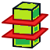

# MeshRemodel Workbench

 

## Toolbar Icon
Download the <a href = "https://github.com/mwganson/MeshRemodel/blob/master/Resources/icons/MeshRemodelSVGLogo.svg">SVG Toolbar Icon</a> 

## Installation
Can be installed via the AddonManager in Tools menu -> AddonManager.  After restarting the AddonManager you should find MeshRemodel in the list of workbenches you can install.
 
## Overview
Use this workbench to aid in remodeling imported mesh objects.  The preferred workflow is to select the mesh, then click either create points object or create wireframe object.  This creates an object with selectable points or edges at all of the mesh vertices or edges.  Use the selectable points or edges to create Mesh Remodel elements, such as points, line segments, arcs, circles, or bsplines.  You can then select those created elements and form a wire using the create a wire (Draft upgrade) tool, which wire can then be also upgraded to a face.  The face can be used with Part Extrude, Part Sweep, Part Revolve, and Part Loft tools to create solids. 
 
## Links to Youtube Videos
 
 
 
 
## Create Points Object
 
Select the mesh object in the tree, then use this command to create a points object containing all the vertices of the selected mesh object.  The points object is a compound consisting of Part Point (vertex) objects, one per vertex in the selected mesh.  The purpose of this object is to provide selectable points in the 3d view.  We can use these selectable points with the other tools in the workbench to create the lines, circles, arcs, and polygons needed to remodel the mesh. 
 
## Create WireFrame Object
 
Select the mesh object in the tree, then use this command to create a wireframe object containing all the edges of the selected mesh object.  The wireframe object is a compound consisting of Part Line objects, one per edge in the selected mesh.  The purpose of this object is to provide selectable edges in the 3d view.  We can use these selectable points with the other tools in the workbench to create the lines and polygons needed to remodel the mesh. 
 
## Create Cross-Sections Object
 
Select the mesh object in the tree, then use this command to create one or more cross-section objects.  This is just a convenience link to the Cross-sections tool in the Mesh Design workbench.  These cross-sections should not be directly used as wires, but rather as references for creating the wires within the MeshRemodel workbench.  This is because these cross-section objects will have extra points and multiple line segments where only one segment is desired. 
 
## Create Coplanar Points Object
 
Select 3 points from the points object in the 3d view to enable this command.  It creates a new points object filtered to contain only those points that are coplanar with the 3 selected points.  Then an empty sketch is created, and added to that empty sketch are links to external geometry for all of the points in the new coplanar points object.  You can recreate the profile inside the sketch using those external links and the sketcher tools or directly in the 3d view using the MeshRemodel tools. 
 
In order to filter the original points object into a set of coplanar points aligned on the plane defined by the 3 selected points an internal isCoplanar algorithm is used.  There is a settings option for changing the tolerance level.  The smaller the number the fewer points get produced.  The filtering is done by using the 3 selected points and each other point in turn to create a tetrahedron.  If the 4 points are coplanar, then the tetrahedron should have volume ~= zero.  Default tolerance is 0.001 mm^3.
 
## Add Selection Observer
 
This enables preselection mode where points get automatically selected by holding Ctrl key down while hovering over the point in the 3d view.  This is intended to make it easier to select all the points needed for making bsplines since there are usually very many points needing selection, but will work with all MeshRemodel tools that create objects from selected points.  DO NOT mix selection modes in the same operation.  For example, if you select any of the points using Ctrl+preselect mode, then do not click on any points to select them in the usual way for the same operation or else it is likely to fail. 
 
Click the icon to enable or to disable Auto Preselection Mode.  There is also a button that will appear in the status bar when this mode is active to indicate you are in Auto Preselection Mode.  You can also click that button to remove the selection observer and return to normal selection mode. 
 
The way the selection observer works is it monitors the preselection of points (only Vertex type objects).  If you are holding down the Ctrl key when the point is first preselected (hovered over with the mouse) that point gets added to a list variable internally called global_picked.  When you use one of the object creation tools that uses selected points, e.g. the bspline or line tool, the tool code will check to see if global_picked contains points, and if so, will use those points.  These global_picked points are not updated if a point is normally selected (by clicking on it).  (But if you deselect a point by clicking on it, then the point will be removed from the global_picked list.)
 
## Create Point Object
 
Select a vertex (or any arbitrary point along any edge or face as of version 1.61) in the 3d view, then use this command to create a point object at that location.  The point object is a Part::Vertex that we can use in some operations, such as Part::Loft or in subsequent Mesh Remodel operations, such as creating a line segment or arc. 
 
## Create Line
 
Select 2 points or 1 edge in the 3d view to enable this command.  It creates a Part Line object using the 2 selected points or the selected edge as a reference.  Note: any 2 selectable points may be used, even points that are part of an edge (the edge is shown selected in the 3d view, but the point at the mouse position is the one used), sketch, 3d object vertex, circle, etc.  If you can see it in the 3d view and select it, then it most likely can be used with this function.  If you select an edge the first point and the last point of the edge are the points used, so curved edges will likely produce unexpected results. 
 
Use Ctrl+Click to include a point at the midpoint of the line.  Use Ctrl+Shift+Click if only the midpoint is desired. 
In the report view you will find some basic information about the line, including its length and coordinates of its midpoint. 
 
## Create Polygon
 
You may elect to remodel the object inside the sketcher using the sketcher line tools instead of this, but it is here for those who wish to use it instead.  The reason it was previously recommended to use the sketcher is some of the polygons created with this tool might not be coplanar, and might give problems with future operations.  But I have found that when you have a coplanar issue you can usually (usually) click upgrade (Create a wire tool) twice (first to make a wire, second to create a face), then use the face successfully where the wire might have failed. 
 
Select 3 or more points or 2 or more edges in the 3d view to enable this command.  It creates a polygon from the selected points or edges.  You should **not** mix points and edges in the same polygon.  Choose either one object type or the other, but not both.  Note: this is not a regular polygon, meaning the side lengths are not necessarily all equal to each other.  The order of selection is important.  By default the polygon will be closed, but you can prevent this with Shift+Click when selecting points.  When selecting edges the polygon will only be closed if the last edge connects back to the first edge. 
 
When selecting using Shift+B, block selection, the points will generally need to be sorted or else you will get a polygon which zig zags all about.  To enable sorting using Alt+Click.  The sorting algorithm takes the first selected point, then finds the nearest point among the other selected points, and puts it 2nd.  Then it uses the 2nd point to find the next nearest point, and puts it 3rd, and so on. 
 
The polygon object created is made up of individual Part Lines.  This will enable you to delete any lines you would prefer not to have, for example if you get a closed polygon, but would prefer it not to be closed or if some lines get crossed, etc.  Use the Create wire tool to upgrade the individual lines to a single wire object, and then click it again to create a face from the wire.  My experience is faces created in this manner are much less likely to fail in a future sweep or extrude due to being non-coplanar. 
 
## Create BSpline
 
Select 3 or more points in the 3d view to enable this command.  It creates a BSpline from the selected points.  The order of selection is important.  By default the BSpline will be closed, but you can prevent this with Shift+Click.  The points need not all lie on the same plane, but if they are not all on the same plane you will not be able to create a sketch from this later.  Sometimes points that appear to lie on the same plane are not actually on the same plane.  It is better to create the bspline in the sketcher. 
 
This command supports block selections (Shift+B, draw rectangle).  Generally, the points will need to be sorted when using that block selection method.  Use Alt+Click to sort.  See the section on Create polygon for details on the sorting algorithm used. 
 
## Create Circle
 
Select 3 (or more) points in the 3d view to enable this command.  It creates a circle from those first 3 selected points.  Any points after the first 3 are ignored, but you are allowed to select more.  This is to support easier block selection mode (Shift+B, draw rectangle).  Use Ctrl+Click to add a point at the center of the new circle.  Use Ctrl+Shift+Click if only the center is desired. 
 
In the report view you will find some basic information about the circle, including its radius and coordinates of the center. 
 
## Create Arc
 
Select 3 points in the 3d view to enable this command.  It creates a Part Arc (internally using Part.ArcOfCircle() function) from those 3 selected points.  Use Ctrl+Click to include a point at the center of the arc.  Use Ctrl+Shift+Click if only the center is desired. 
 
In the report view you will find some basic information about the arc, including its radius and coordinates of its center. 
 
## Create Wire
 
Select 2 or more objects to enable this command.  It uses Draft.upgrade() to connect the objects into a single wire.  It is here as a convenience.  Note: the selected objects should all be connected together, but need not necessarily form a closed loop.  For example, you might have an arc and 2 lines connected one to each end of the arc.  You should not include circles unless you wish to connect them to other objects (not common).  The idea here to create wires from connected lines, open polygons, and arcs, then use these new wires, along with existing (coplanar) circles and closed polygons to create a sketch with the Create Sketch tool or you can also use the wires directly with Part workbench tools like, extrude or sweep.  As noted in other sections of this document, it is often useful to use this again on the created wire to form it into a face. Faces tend to work better with other tools rather than wires, particularly in cases where the tool complains the wire is not coplanar.  If you get that error message run this tool again on the wire and upgrade it to a face.  Then try the tool that complained the wire was not coplanar again. 
 
## Create Sketch
 
Creates a sketch, optionally attached to 3 points on a plane if 3 points are selected.  This does not create any links to external geometry.  See Create coplanar points command if you want to automatically import all coplanar points that lie on this same plane. 
 
Use Ctrl+Click to make a sketch out of selected circles, polygons, etc.  If a circle or arc is the first selected object, it will map the sketch concentrically to that circle or arc.  Note: there is a known issue using this method that sometimes objects that appear to be coplanar might not actually be coplanar.  It is recommended to remodel using the sketcher with links to external geometry to the points objects instead of this method. Uses method of creating a single sketch from all selected objects. 
 
Use Alt+Click to create multiple sketches, one from each object selected, and then merge them all together into a single sketch, deleting the temporary sketches afterward.  This can sometimes resolve coplanar issues. 
 
## Merge Sketches
 
Select 2 or more sketches to enable this command.  This uses Sketcher workbench merge sketches command.  It is here as a convenience. 
 
 
## Validate Sketch
 
Opens Sketch workbench validate sketch tool.  Enabled only if you have 1 sketch selected.  It is here as a convenience.  Occasionally, sketches will have missing coincidence constraints.  That tool is good for fixing that issue.  It can also be used to easily remove all links to external geometry. 
 
## Settings
 
### Keep toolbar active
This setting will keep the toolbar active after leaving the workbench, but you have to open the workbench at least once each session.  After that, if this is enabled, when you leave the workbench the toolbar will appear in the new workbench after a couple seconds.  This can be a great time saver as you would often use this tool in conjunction with Part workbench in remodeling a mesh.  This would prevent the need to switch back and forth between workbenches. 
 
### Point size
This sets the point size on all points created with the workbench.  It does not affect objects already created after the setting is changed, only those created after the setting is changed.  Does not affect wire objects or sketch objects, only the centers of arcs, circles, and polygons, and the midpoints of lines.  Default 4.0 
 
### Line width
This sets the line width on all lines created with the workbench.  It does not affect objects already created after the setting is changed, only those created after the setting is changed.  Does not affect wire objects or sketch objects, only the edges of arcs, circles, lines, and polygons.  Default: 5.0 
 
### Sketch radius precision
This sets the precision to use when constraining radii (for circles and arcs) when creating sketches.  These are integer values from -1 to 12.  If -1, then no constraining of any radii occurs.  If 0, then radii are constrained to maximum precision.  If > 0, then radius constraints are rounded to that many digits precision, e.g. 1 results in 1.5, 2 in 1.49, 3 in 1.498, etc. Default: 1 
 
### Coplanar tolerance
This sets the tolerance to use when determining which points lie on the same plane as the 3 selected points that define the plane.  Higher numbers mean less restrictive results, producing more points, not all of which might be accepted as coplanar in later operations.  This is not an issue when modeling within the sketcher using links to external geometry.  It is recommened to not change the default unless you are missing some points that you think should be included or perhaps you are getting points that should not be included.  The tolerance number represents the volume of a tetrahedron created using the 3 selected points and the point currently under consideration in cubic mm.  It's also used in creating a wireframe object, but should rarely need to be changed for that purpose.  If you find some edges of the wireframe are missing, try making this smaller.  Default: 0.001 mm^3
#### Release notes: 
* 2020.08.29 (version 1.7) 
** add auto selection mode (hold Ctrl+preselect to select points)
* 2020.08.26 (version 1.67) 
** optimize creation of wireframe objects
* 2020.08.23 (version 1.661) 
** change label of progress bar
* 2020.08.23 (version 1.66) 
** Add progress bar and cancel button to status bar for wireframe creation since it can be a long task
* 2020.08.22 (version 1.65) 
** Move Create Point Object icon/command next to Create Line icon/command
* 2020.08.22 (version 1.64) 
** User Draft bsplines since they are more parametric
* 2020.08.22 (version 1.63) 
** Remove merge sketch from toolbar, but keep as menu item
* 2020.08.22 (version 1.62) 
** Remove sketch validation from toolbar, but keep as menu item
* 2020.08.22 (version 1.61) 
** Allow to use point on a face as picked point for creating point object, in addition to vertex and edge
* 2020.08.19 (version 1.6) 
** Add convenience link to Mesh Design workbench Cross-sections tool
** Allow to create a point object at an arbitrary picked point along an edge in addition to a vertex
* 2020.08.15 (version 1.51) 
** move to using parametric Draft lines, arcs, and circles for more parametric possibilities.
** add option to create all variants of arcs by 3 points (alt+click)
* 2020.08.14 (version 1.5) 
** added WireFrame object -- works like creating a Points object, but creates the edges instead of the vertices
** Make Polygon tool can now work with selected edges as well as selected points (but not both at the same time)
** Make Line tool can now make a line from 2 selected points or from a selected edge.
* 2020.08.06 (version 1.43) 
** added create a point command
* 2020.08.05 (version 1.42) 
** add downgrade option to upgrade (shift+click to downgrade)
* 2020.08.05 (version 1.41) 
** select the lines and arcs used to create a wire after wire creation (updgrade) so it is easier to delete them
** select the lines after creating a polygon so it is easier to upgrade them to a wire
* 2020.08.05 (version 1.4) 
** improved settings dialog to show current settings
** no longer using Draft coplanar check
** no longer creating sketch by default when creating coplanar points object
** default coplanar tolerance now 0.0001 mm (was .001 mm)
* 2019.08.28 (version 1.31) 
** open sketcher workbench when needed to prevent errors
* 2019.08.22 (version 1.30) 
** Lots of changes here.  We've moved from creating objects in the 3d view to be used later for creating a sketch to creating an empty sketch with links to external geometry automatically added.  Elements are then created directly in the sketch using sketcher tools.  This is to avoid some coplanar issues that can arise out of creating elements in the 3d view with the tools in this workbench. 
* 2019.08.20 (version 1.292) 
** option to attach sketch concentrically to first selected object, if that is a circle or arc with Shift+Click.
** bug fix where sketch is sometimes reported as noncoplanar, but lost ability to place equality constraints on some circles/arcs
* 2019.08.20 (version 1.291) 
** fix bug in calls to gu.isColinear()
* 2019.08.20 (version 1.29) 
** reorganize code internally, consolidating geometry utilities into a single class 
** accessible via python: 
**  from MeshRemodelCmd import MeshRemodelGeomUtils 
**  gu = MeshRemodelGeomUtils() 
**  gu.circumcenter(A,B,C) 
**  gu.circumradius(A,B,C) 
**  gu.inradius(A,B,C) 
**  gu.incenter(A,B,C) 
**  gu.dist(A,B) 
**  gu.getDistance3d(Ax,Ay,Az,Bx,By,Bz) 
**  gu.isCoplanar(A,B,C) 
**  gu.isColinear(A,B,C) 
**  gu.nearestPoint(pt, pts, exclude) 
**  gu.sortPoints(pts) 
**  gu.midpoint(A,B) 
**  additional commands via the python API (since v1.5): 
**  gu.isSamePoint(A,B,tolerance) 
**  gu.hasPoint(pt,ptsList,tolerance) 
* 2019.08.20 (version 1.28) 
** add sketch radius precision to settings
* 2019.08.20 (version 1.27) 
** add shift+click option in creating coplanar points that are not exploded
* 2019.08.20 (version 1.26) 
** fix coplanar point filter when original mesh was rotated
* 2019.08.20 (version 1.25) 
** make sketch now constrains radii to precision = 0.1 mm
** try to place sketch even with first selected object center of mass
* 2019.08.20 (version 1.24) 
** remove ? from title bar in settings dialog
* 2019.08.19 (version 1.23) 
** show version info in settings dialog
* 2019.08.19 (version 1.22) 
** convenience link to sketcher validate tool
* 2019.08.19 (version 1.21) 
** fix for polygons needing coincidence constraints
* 2019.08.19 (version 1.20) 
** add coplanar points object creation 
** revert automatic selection of bspline and polygons for easier redo 
** make polygons compound lines, explodable via undo (Ctrl+Z) 
** support block select (Ctrl+B) for polygons, bsplines, and circles 
* 2019.08.18 (version 1.10) 
** add bspline creation
* 2019.08.18 (version 1.02) 
** add settings for point size and line width
* 2019.08.18 (version 1.01) 
** Add some simple information for created objects in the report view 
* 2019.08.16 (version 1.00) 
** Initial version
