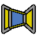

# MeshRemodel Workbench

 

## Toolbar Icon
Download the <a href = "https://github.com/mwganson/MeshRemodel/blob/master/Resources/icons/CreatePointsObject.svg">SVG Toolbar Icon</a> 

## Installation
Can be installed via the AddonManager in Tools menu -> AddonManager.  After restarting the AddonManager you should find MeshRemodel in the list of workbenches you can install.
 
## Overview
Use this workbench to aid in remodeling imported mesh objects.  The preferred workflow is to select the mesh, then click either create points object or create wireframe object.  This creates an object with selectable points or edges at all of the mesh vertices or edges.  Use the selectable points or edges to create Mesh Remodel elements, such as points, line segments, arcs, circles, or bsplines.  You can then select those created elements and form a wire using the create a wire (Draft upgrade) tool, which wire can then be also upgraded to a face.  The face can be used with Part Extrude, Part Sweep, Part Revolve, and Part Loft tools to create solids. 
 
## Links to Youtube Videos
 
 
 
 
## Create Points Object (mesh objects)
 
Select the mesh object in the tree, then use this command to create a points object containing all the vertices of the selected mesh object.  The points object is a compound consisting of Part Point (vertex) objects, one per vertex in the selected mesh.  The purpose of this object is to provide selectable points in the 3d view.  We can use these selectable points with the other tools in the workbench to create the lines, circles, arcs, and polygons needed to remodel the mesh.  These can also be used in repairing meshes in conjunction with the remove point, move point, and add or remove facet tools. 
See also the Create WireFrame object, which can be used for the same purpose.  Which to use is up to you, but I recommend using this Points object because it is much, much faster to recompute.  Also, when adding facets to the mesh object, which is going to be the most common usage of the tool, you need to select points instead of edges anyway in order to better control the order of selection of the points, which is critical to the process.  Edge selection, although a bit easier than vertex selection doesn't work as well for adding multiple consecutive facets. 
**Tip: I have found when selecting the vertices to add a facet that if I select them in counter-clockwise fashion the facets created are more likely to have the proper normal orientation.**
 
If you hold Ctrl key down while invoking this command the mesh object will be made partially transparent and non-selectable in the 3d view.  You can still select it in the tree view, but it will not appear to be selected in the 3d view and on mouse over you will not see it change to pre-select color.  This will make it easier to see the MR_Points object.  These settings can be changed in the mesh object's view tab in the property view.  Even without Ctrl the mesh will be set to DisplayMode = "Flat Lines", so you can see how the points connect to make up the facets, and the Lighting property is set to "One side" so you can see if there are any flipped normals.
 
Update: As of v1.82 you can now also create a points object from a Points cloud object created in Points workbench, which are non-selectable.  So, if you need to be able to select the individual points in a points cloud use this tool to create the selected points object.  Because the Points cloud object points are non-selectable the algorithm uses the first 3 points in the object to define the plane.  If those 3 points are colinear then it won't work. 
 
## Create WireFrame Object (mesh objects)
 
Creates a parametric object based on Part::FeaturePython class from the selected mesh object.  The lines and vertices
of this object serve as a proxy for the lines and vertices of the mesh object, which are not selectable individually in FreeCAD.  You select the edges and vertices of the proxy object and MeshRemodel will translate those selections into selections of the mesh object for the purposes of the various mesh repair tools available in MeshRemodel, including the move point too, the remove point too, and the add/remove facet tool.  See also the Create Points Object command. 
 
## Mesh Boundary Wires (mesh objects)
 
Creates wires from the holes in a mesh.  If a wire is planar, then a meshed face is also produced.  This meshed face may be merged with the original mesh in the Mesh workbench to fill in the hole left after a mesh is trimmed with a plane in that workbench.  The mesh will need to repaired after this merger because at the very least there will be some duplicated points that must be removed. 
This function is a good diagnostic tool to help find holes in a mesh that might not be evident upon a brief examination.  It can also show defects that are difficult to find, such as where 2 points are very close to each other and the mesh has tiny facets that need to be fixed.
## Move Point (mesh objects)
 
This tool works on mesh objects.  You need to create a points object or a wireframe object from the mesh first in order to have selectable points to work with.  Select the mesh object and a point from the points object to be moved, then click the toolbar icon.  You will get a dialog in which you can set the new coordinates for the point.  The changes the mesh object, but you can use Undo to undo the changes. 
 
Notice in the above screenshot there is a red dot on the screen.  This shows the new position of the point once you click OK.  The Normal spinbox at the bottom of the dialog is used to move the point along its normal vector.  If you change the Normal field it resets the other X, Y, and Z fields to their defaults, and then applies the calculations needed to move them in the point's normal direction by the amount specified in the Normal field.  For Mesh objects the normal direction of a point is a direction outward from the mesh, calculated from the angles of the facets connected to that point.  This value can be positive or negative, depending on which way you wish to move the point.  Keep in mind this changes the mesh topology and could create issues, such as self-intersections or folds on surface.  It's a good idea to check your mesh after adding the point with the Mesh workbench analyze tool.  If moving the point has introduced defects to the mesh, then you have the option of using Undo to undo the changes. 
In addition to selecting a point and moving it via the dialog, you can also select 2 points.  The first point selected is the point to be moved, and the second point is the destination.  In this manner you can merge the 2 points together. 
## Remove Point (mesh objects)
 
With this tool you can remove a point from (or add a new point to) a mesh.  When the point is removed all of the facets connecting to it are also removed.  Not to worry, it's fairly simple to add facets back to replace the ones that get removed by using the add facet tool, described below.  If you don't want to lose the facets it might be possible to move the point to another point in the mesh instead.  This will preserve the facets and bind them to the other point. 
To add a point you must first select an edge that already contains 2 points in the mesh.  Then use Alt+Click to add the new point.  This splits the facets that share the edge, creating 2 new facets at the picked point on the edge. 
Another way to add a new point is by adding a new facet with the add facet tool.  The point to be added is a picked point you have selected that is not already part of the mesh when you add the new facet.  Use the create point object command to add a new point to select or use a vertex of another object, such as a cube. 
## Add or remove facet(s) (mesh objects)
 
This is a great tool for repairing defective mesh objects, perhaps eliminating the need for remodeling them in many cases.  Usage: first create either a points object or a wireframe object from the mesh object.  With that done, select the 3 points that define the new facet (or 2 edges that contain all 3 points) and click the toolbar icon to add it to the mesh.  This operation changes the mesh topology directly, so it could be a good idea to first duplicate the mesh object and work on the duplicate instead of the original.  That way you can always go back to that original object state if things don't work out as planned. 

Often times the new facet will have its normal flipped, meaning it is facing inwards instead of outwards.  To remedy this when it happens, use Alt+Click on the toolbar icon.  This will remove the facet. Then use Ctrl+Click again to flip it around so its normal side is facing out.  How to tell whether the normal is flipped?  The back side of the facet will be black while the front side will be default gray.  With the object selected (as required by this command to be active) the colors will be dark green for the back side and a lighter shade of green for the front side.  Against the backdrop of other back sides of the mesh it can appear at times that no facet was created.   

Adding a facet or 2 can be relatively easy, but when there are many facets to add it can become quite tedious.  This command can alleviate that to a degree by allowing for creation of multiple facets in one go.  Usage: select first the anchor point (which will be common to all created facets), and then the remaining points.  As an example, let's call these points p1, p2, p3, p4, p5, p6, and p7.  These are the 7 points you selected.  p1 becomes the anchor point, so choose it wisely as not to have crossed edges or self-intersections.  The facets that get created are p1, p2, p3 -- p1, p3, p4 -- p1, p4, p5 -- p1, p5, p6 -- p1, p6, p7 -- and so on.  To close an open face it could be useful first to add a central point and use that for the anchor.  Ctrl+Click also works to flip all the normals on the faces created with multiple selection.  Just remove them with Undo or Alt+Click if everything is still selected, and then Ctrl+Click to add them back flipped.  Note that there is also a Harmonize normals function available via the context menu of the points or wireframe object, and another to flip all the normals of an entire object. 
Another tool you will want to become familiar with when repairing meshes is the analyze and repair tool, also available in the context menu.  Use it to analyze and repair the mesh, and then use add facets in MeshRemodel to add any facets back that were removed by the repair tool.  Usually, the new replacement facets will be good, so don't worry too much that you will be adding facets that will only get removed again by the repair tool.  You can keep the repair tool dialog open while working to add the facets and periodically recheck to ensure the new facets are not defective as you work.  There is a button at the bottom of the repair tool dialog that applies the analyze tool of all the tests in one go. 

## Mesh Expander (mesh objects)
 

This tool creates a new parametric Mesh::FeaturePython object that is a copy of the original object, but that is expanded at the position of a plane.  You must supply a plane object, which can be either a Part::Plane or a PartDesign::DatumPlane.  The new feature python object is named MeshExpander and it will claim as a child in the tree view the original mesh object, which has now been hidden.  The mesh is expanded at the position of the plane, 5 mm by default in the normal direction of the plane.  Note that the plane is treated as an infinite object here.  Experiment with the Expansion and ExpansionRev properties to see how this works.  An example usage would be where you would like to make some mesh object longer in one direction, but you don't want to scale it.  Look for some place in the mesh where there is already a uniform length of material. 
The MeshExpander object is parametric to any changes to the original mesh and to any changes you make to any of its properties, but it is not parametric to the plane object.  You can move the plane, for example without affecting the MeshExpander object.  The plane is used at creation time to calculate the Base and Normal properties of the MeshExpander object.  You can modify those directly if you want to reposition the plane.  (Alternatively, delete the MeshExpander object, reposition the plane, and create a new MeshExpander.) 
Be advised that the MeshExpander will inherit any defects in the original mesh object, and quite possibly can introduce a few more of its own.  You can check it for errors and make repairs as you would to any mesh, but keep in mind if you edit the MeshExpander properties it will recreate the mesh object, so you might want to make a copy of it instead and edit that copy. 
Note: It can take some time for the MeshExpander to do its job, particularly with larger, more complex meshes, and FreeCAD might become unresponsive for a time.  Be patient. 
 
In the image above the mesh object has been expanded.  Note how the edges are different.  Note also the position of the datum plane used to define the plane.  Expansion can be up or down relative to the normal of the plane, but you should use the Expansion property for expansion in one direction and ExpansionRev property **(with a negative value)** for expansion in the other direction. 
Note: The oppositive function (collapsing a mesh) is not supported. 
There is a boolean property named ShowCrossSection.  If this is set to true, then on each recompute you get a new object in the tree, which is the cross-section of the mesh at the location of the plane, again, the plane is treated as an infinite object.  Cross-sections can be useful for remodeling a mesh, so this a side-effect feature that you might want to keep in mind is available.

## Mesh simple copy
 
Select a mesh and run this command to make a simple non-parametric copy of it.  Sometimes a non-parametric copy is needed when you are working with a parametric mesh object, such as the MeshExpander object or one of the Mesh primitives in the Mesh workbench, such as the Cube or the Cylinder.  It is also a good idea to make a copy of a mesh and work on the copy rather than the original.  That way if things don't go well you can always make another copy of he original and begin again from that starting point. 

This operation will also create a new empty mesh if nothing is selected to duplicate.  This can be useful if you are
going to be duplicating facets from one mesh to another. 

## MeshOffset
 
Offset a mesh by moving it's points along their normals by the specified distance in the Offset property.  Offset is a floating point property that gets interpreted as mm.  This might not always work as expected and can cause defects in the mesh, so it's a good idea to run mesh evaluate and repair on the results.  But it can also in some cases cure some defects in the mesh.  In particular I have found it can cure some folds on surface errors. 

If the source mesh is a non-solid mesh, meaning only a single wall, then you can set the Merge Source property to True and it will merge the orignal source mesh with the offset.  This will still leave a gap that will need to be filled manually using the add facet tool.  Since this is a parametric object that will recompute itself it is a good idea to make a simple copy of it and work on the copy instead of working to repair this object directly.  Otherwise it might recompute and undo all of your repairs. 

The ZMin and ZMax properties are provided by the python API, but I am not sure exactly what they do.  There are 2 offset functions available for mesh objects: mesh.offset() and mesh.offsetSpecial(), the latter of which accepts the additional ZMin and ZMax arguments.  If you set these to 0.0 (the default) then the normal mesh.offset() function is used. 

## SubObjectLoft
 
Select 2 subobjects in the 3d view, then run this command to loft between those subobjects.  Uses the new SubObjectLoft object for some selection types, the new ParametricLine type for some, and Part::Loft for others. 
 
Selection type -> result
* 2 Faces -> SubObjectLoft (solid)
* 1 Face, 1 Vertex -> SubObjectLoft (solid)
* 2 Edges -> Part::Loft (face)
* 2 Vertices -> ParametricLine (line segment)
* 1 Edge, 1 Vertex -> Part::Loft (face)
### ParametricLine
This is a parametric line object.  Select 2 vertices, and then run the SubObjectLoft command to create a "loft" between them.  Link1 and Link2 refer to the referenced vertices.  Link1Extend and Link2Extend are length properties that can extend the line segment beyond Link1 and Link2 or shorten the line.  Info gives information about the line: Length and Direction.

### SubObjectLoft Object
This object lofts between a face and a vertex or 2 faces to each other.  It supports faces with inner wires where Part::Loft fails, but it does not support more than 2 sections, unlike Part::Loft, which supports any number of sections.  When the loft is between a face and a vertex a scaled copy of the face is made, which is positioned at the location of the vertex and pointed towards the original face, and then the loft is made between those 2 faces.  There are 2 hidden properties that are shown when a vertex is one of the subobjects: VertexFaceScale and VertexFaceRotation.  The scale option controls the scale factor.  The rotation property controls the rotation of the scaled face.  This can be used where you want to loft a face to a scaled and rotated copy of itself.  Here, the rotation property acts much like an attachment offset property, with the Z axis always being the face normal.  You can use the rotation to better control the seamlines of the loft to prevent some twisting.

## Create GridSurface Object
 
Creates a GridSurface object.  Along with the Grid Surface object are created individual Part::Vertex objects, each assigned to a row and column in a grid.  The vertices serve as points for creating the GridSurface object shape, which can be a surface or a series of bspline edges or polyline wires.  As the individual vertices are moved the GridSurface object automatically recomputes its shape.  If the Output property is set to Surface, then the surface that is created can be done in a couple different ways: lofting the edges/wires and by directly interpolating the points into a surface.  Lofting generally works better and is the default.  An even better surface can usually be had by setting the Output to Gordon Surface Template, and then creating a Gordon Surface using the Curves workbench Gordon Surface tool with the Grid Surface object as the source.

### Dimensions property group
Count Columns and Count Rows properties determine the number of columns and rows the grid will have.  You can use these to add more rows or columns or remove the last row or column without impacting any changes you might have made to existing vertices in the grid unless you remove them by reducing the number.  The XInterval and YInterval properties will cause the grid to be rebuilt, overwriting any changes already made to individual vertex objects, but this can be undone using Ctrl+Z undo.  Moral: Decide on the desired intervals before doing too much work on the grid.

### Grid Surface property group
Column Mode is false by default.  The default is row mode, meaning the edges used for the loft or for the Gordon template will be rows of edges formed from the points in each row.  In Column Mode the edges are formed from the points in each column.

Method property has options: Interpolate points, Lofted Edges, or Lofted Edges Ruled.  Note that in column mode the edges are columns, and in row mode they are rows.  Interpolate points makes the surface internally as a Part.BSplineSurface object.  In the Loft modes instead the edges are lofted to form the surface.  This gives a bit more control and is the default.

Output defines whether the GridSurface object shape is a surface, edges, or a Gordon template.  The Gordon template can be the source for a Gordon Surface created in the Curves workbench addon.  Edges mode is mostly useful to help visualize how the surface is generated with the loft.  In some cases you might need to switch from row mode to column mode for better results.

Post Wire Edges and Pre Wire Edges.  When working in Loft mode the edges of other objects may be used to form part of the Loft.  This allows to connect the GridSurface object to other objects in a manner that should generally succeed.  Select the property, open the property editor with the [...] button, and select in the 3D view the edges to use.  The Pre Wire Edges are connected to row 0 (or column 0 in column mode) and the Post Wire Edges are connected to the last row or column.

Reversed can be used to flip the normal of the surface, if desired.

### Vertices property group
Grid Visibility allows to toggle all the Part::Vertex objects visibility in one go.  This is also accessible via the context menu for the GridSurface object.
Point Size allows to set the Point Size of all the Part::Vertex objects in one go.
Vertices is the list of Vertex objects used in the grid.  Note that it is possible to delete one or more of these without wrecking the GridSurface object, but it also might get broken.  Each Part::Vertex is given 2 new properties: Row and Column in a Grid Surface property group.  These are used to track the position of each Vertex in the group.  This affects how the vertices are all connected in the proper order when making the edges.

You can add a new Part::Vertex object by dragging and dropping it onto the GridSurface object.  Upon recompute you will be asked in a dialog to specify which row and column the new vertex should occupy.  The vertex in question will be selected for you to help you find it.  It is important to enter the correct row and column values because they cannot be easily edited later since the remaining vertices on that same row (or column if in column mode) will get their column properties incremented during this step.  If you cancel either dialog the row and column properties will get set to -1, a flag that tells the GridSurface object to ignore this vertex on recompute.  At that point the best thing to do is delete the vertex, create a new one, and try again.

You can drag/drop multiple vertices at the same time, but as you answer the row/column dialogs make sure you are not yet counting those vertices that have not yet been assigned row/column values.  Better to do this one at a time.  It might be necessary to mark the document to recompute and do a full recompute if the new vertices do not appear to be in the correct order.  Right click the grid surface and click recompute object to see if that corrects the issue.  Check the vertices row and column values to ensure they look right.  Remember, row and columns are 0-indexed, so the first vertex in each row is at column 0, not column 1.

Upon recompute, when an unassigned vertex is found in the fp.Vertices property, you will be asked whether to shift the remaining vertices.  Options are yes, shift all, yes, but only this row/column, or no, no shifting.  This reassigns row/column positions to vertices to the right or above this vertex in the default grid position.  It doesn not move any points, but merely changes row/column assignment.  Normally, you should choose to shift all for the first vertex added in this manner, but then shift only the current row/column for the next if it is on the same row/column as the previously inserted vertex.  No shifting might result in a conflict where more than one vertex has the same row/column assignment.  What happens then is unpredictable as to which will be used.  This error condition is not checked for at this time.

### Context menu
In the context menu you manipulate a number of the above described properties.  You can also select multiple vertices by row or column, allowing manipulation of the entire row or column in one go.  You would do this by editing their X, Y, and Z properties.  But do not edit their placements while a group of them are selected or else they will all end up in the same coordinate.  Note that the Part::Vertex objects can also be attached to other vertices.  They can also be moved using the MeshRemodel Move Axial tool by first selecting the vertex to be moved, then the new vertex location, and then clicking the Move axial toolbar icon.  This is quick and easy, but not parametric in the even the target vertex moves.

## Create Cross-Sections Object
 
Select the mesh object in the tree, then use this command to create one or more cross-section objects.  This is just a convenience link to the Cross-sections tool in the Mesh Design workbench.  These cross-sections should not be directly used as wires, but rather as references for creating the wires within the MeshRemodel workbench.  This is because these cross-section objects will have extra points and multiple line segments where only one segment is desired. 

## Create Coplanar Points Object
 
Select 3 (non-colinear) points from the points object in the 3d view to enable this command.  It creates a new points object filtered to contain only those points that are coplanar with the 3 selected points.  You can recreate the profile inside the sketch using those external links and the sketcher tools or directly in the 3d view using the MeshRemodel tools.  The Coplanar Points Object (CPO) is now a feature python object. 
 
In order to filter the original points object into a set of coplanar points aligned on the plane defined by the 3 selected points an internal isCoplanar algorithm is used.  There is a settings option for changing the tolerance level.  The smaller the number the fewer points get produced.  The filtering is done by using the 3 selected points and each other point in turn to create a tetrahedron.  If the 4 points are coplanar, then the tetrahedron should have volume ~= zero.  Default tolerance is 0.01 mm^3. If too high a tolerance value is used you will get points that are not truly coplanar, but they will forced into coplanarity by projecting them onto the plane.
 
## CPO Properties
### Base Points Object
This is typically a MR_Points object.  It is the object upon which the CPO is based, so do not delete it or else you will break the CPO. 
 
### Explode Compound
Trigger.  Triggers a command and sets itself back to False.  Explodes the CPO just as if you had used Part workbench Compound Explode tool on it.  The points are now individually editable, meaning you can delete the ones you do not want or adjust their placement properties.  This also makes them selectable via the Shift+B box selection tool.  Adjusting placement of individual points can be very handy at times, so remember this feature, but be wary of the working plane when moving points. 
 
### Make Sketch
Trigger.  Triggers a command and sets itself back to False.  Makes a new sketch, attaches it to the Trio points (the 3 points of the BasePoints object originally selected when the CPO was first created) using MapMode = "ThreePointsPlane", and adds all points in the CPO to the sketch as links to external geometry. 
 
### Point Size
Adjust this to change the point size for this CPO (does not change default value in the settings).  The same property is available in the view tab, but this overrides that one.  It is here for convenience. 
 
### Points
These are the vectors of the points in the CPO.  They are not readonly, but you should not modify them directly because they get recreated with each recompute.  I was intending to make this property readonly, but in that mode you cannot access the editor and see the table view.  If you want to remove or modify individual points, use the Explode Compound feature. 
 
### Tolerance
Tolerance defines how the points that are coplanar are selected.  I will likely be changing the algorithm in the future, but for now a 4 sided tetrahedron is created with vertices: the Trio and each other point in the BasePoints object in turn.  If the volume of the tetrahedron is tolerance or less the 4th point is considered to be on the plane.  Higher tolerance values will produce more points in the plane.  Do not worry about the extra points not being on the plane as they are projected to the plane.  Setting Tolerance = 0 means do not use any tolerance, but rather put all the BasePoints object points in. 
 
### Trio
These are the 3 vertices you selected when you first created the CPO.  They are used in a number of ways.  If a sketch is created they are the support for the sketch attachment.  When the CPO is created they are used to define the plane.
## Add Selection Observer
 
This enables preselection mode where points get automatically selected by holding Ctrl key down while hovering over the point in the 3d view.  This is intended to make it easier to select all the points needed for making bsplines since there are usually very many points needing selection, but will work with all MeshRemodel tools that create objects from selected points.  DO NOT mix selection modes in the same operation.  For example, if you select any of the points using Ctrl+preselect mode, then do not click on any points to select them in the usual way for the same operation or else it is likely to fail. 
 
Click the icon to enable or to disable Auto Preselection Mode.  There is also a button that will appear in the status bar when this mode is active to indicate you are in Auto Preselection Mode.  You can also click that button to remove the selection observer and return to normal selection mode. 
 
The way the selection observer works is it monitors the preselection of points (only Vertex type objects).  If you are holding down the Ctrl key when the point is first preselected (hovered over with the mouse) that point gets added to a list variable internally called global_picked.  When you use one of the object creation tools that uses selected points, e.g. the bspline or line tool, the tool code will check to see if global_picked contains points, and if so, will use those points.  These global_picked points are not updated if a point is normally selected (by clicking on it).  (But if you deselect a point by clicking on it, then the point will be removed from the global_picked list.)
 
## Part Solid
 
Convenience link to 4 commonly used tools to create Solids in Part Workbench.  Links to the Sweep, Loft, Revolve, and Extrude commands.  Some preprocessing is done in order to sometimes enable solid creation while bypassing the Gui dialogs.  For example, you can select the Sweep profile in the tree view and the edge to sweep the profile along in the 3D view to create the Sweep without ever opening the Sweep dialog.  If you don't get the selections right then the dialog will appear as it normally does in Part Workbench.
### Part Extrude
Usage: Select your profile object in either the tree view or the 3D view, then optionally select and edge to be used as a direction, and then click the toolbar Part Solid icon.  If the profile is closed and planar we set Solid = True, else Solid is set to False.  Be sure to check the Solid property of the created Extrude object.  If it's not set to Solid = True, then chances are the wire used wasn't closed or wasn't planar.  If an edge is selected it is linked to the Extrude object and becomes a dependency.  The LengthFwd property is set to the length of the selected edge.  If no edge is selected 10 mm is the LengthFwd and the direction mode is set to "Normal".  If the normal can't be determined the direction mode is set to "Custom", which defaults to Z = 1 direction.  If the Extrude is done in the wrong direction, just toggle Reversed to True in the Extrude property view. 
### Part Sweep
Usage: Select your profile in the tree view and your edges to use as the path for the sweep in the 3D view, and then Ctrl + CLick on the toolbar icon.  More than one profile (section) may be used with Part Sweep.  It is important to select them all in the tree view because that's how we determine which selections are the profiles and which are the paths.  All path edges must belong to the same parent object.  This is a requirement of the Part Sweep tool and there's nothing to be done about that except to put all the edges into the same object.  We can do that in a number of ways.  The preferred way is to create a wire from those edges and use the edges of the wire for the path.  Another method is to create a SubShapeBinder object from those edges.  MeshRemodel will create a SubShapeBinder for you if you choose that option in a popup dialog.  You will have 2 options for the Binder: parametric and non-parametric.  If you choose parametric the Binder and the Sweep will adjust themselves automatically to changes in the edges to which the Binder is linked.  The downside to this option is now you cannot delete those objects without breaking the Binder and the Sweep.  (You can set the Binder's BindMode property to either Detached or Synchronized to change this, but once detached the links are gone forever.)  After creating the Binder you will then need to try again, this time selecting the edges of the Binder instead of the original edges, which will now be hidden to prevent accidental selection. 
RECAP: Select the profile first in the Tree view, and then the path edges in the 3D view.   
### Part Loft
Usage: Select your profiles in the tree view or in the 3D view and Shift + Click the toolbar icon to do the Loft.  A limitation of the Part Loft tool is the profiles may not contain inner wires (for example, donut shape).  The Gui dialog checks for this and you don't even see the profiles with inner wires in the selection column as options, but no checks are done here.  This same limitation applies to Part Sweep, but not to Part Extrude and Part Revolve.  (But Part Extrude cannot extrude such profiles at a taper.) 
### Part Revolution
Usage: Select your profile in the tree view or the 3D view and optionally your edge to serve as an axis of revolution, and Alt + Click the toolbar icon.
## Create Point Object
 
Select a vertex (or any arbitrary point along any edge or face as of version 1.61) in the 3d view, then use this command to create a point object at that location.  The point object is a Part::Vertex that we can use in some operations, such as Part::Loft or in subsequent Mesh Remodel operations, such as creating a line segment or arc.  You must select some object first.  A point cannot be created in any arbitrary empty location, but you can create a point on an edge, for example, and then move it to the desired location. 
 
## Create Line
 
Select 2 points or 1 edge in the 3d view to enable this command.  It creates a Part Line object using the 2 selected points or the selected edge as a reference.  Note: any 2 selectable points may be used, even points that are part of an edge (the edge is shown selected in the 3d view, but the point at the mouse position is the one used), sketch, 3d object vertex, circle, etc.  If you can see it in the 3d view and select it, then it most likely can be used with this function.  If you select an edge the first point and the last point of the edge are the points used, so curved edges will likely produce unexpected results. 
 
Use Ctrl+Click to include a point at the midpoint of the line.  Use Ctrl+Shift+Click if only the midpoint is desired. 
In the report view you will find some basic information about the line, including its length and coordinates of its midpoint. 
 
## Create Polygon
 
You may elect to remodel the object inside the sketcher using the sketcher line tools instead of this, but it is here for those who wish to use it instead.  The reason it was previously recommended to use the sketcher is some of the polygons created with this tool might not be coplanar, and might give problems with future operations.  But I have found that when you have a coplanar issue you can usually (usually) click upgrade (Create a wire tool) twice (first to make a wire, second to create a face), then use the face successfully where the wire might have failed. 
 
Select 3 or more points or 2 or more edges in the 3d view to enable this command.  It creates a polygon from the selected points or edges.  You should **not** mix points and edges in the same polygon.  Choose either one object type or the other, but not both.  Note: this is not a regular polygon, meaning the side lengths are not necessarily all equal to each other.  The order of selection is important.  By default the polygon will be closed, but you can prevent this with Shift+Click when selecting points.  When selecting edges the polygon will only be closed if the last edge connects back to the first edge. 
 
When selecting using Shift+B, block selection, the points will generally need to be sorted or else you will get a polygon which zig zags all about.  To enable sorting using Alt+Click.  The sorting algorithm takes the first selected point, then finds the nearest point among the other selected points, and puts it 2nd.  Then it uses the 2nd point to find the next nearest point, and puts it 3rd, and so on. 
 
The polygon object created is made up of individual Part Lines.  This will enable you to delete any lines you would prefer not to have, for example if you get a closed polygon, but would prefer it not to be closed or if some lines get crossed, etc.  Use the Create wire tool to upgrade the individual lines to a single wire object, and then click it again to create a face from the wire.  My experience is faces created in this manner are much less likely to fail in a future sweep or extrude due to being non-coplanar. 
 
## Create BSpline
 
Select 3 or more points in the 3d view to enable this command.  It creates a BSpline from the selected points.  The order of selection is important.  By default the BSpline will be closed, but you can prevent this with Shift+Click.  The points need not all lie on the same plane, but if they are not all on the same plane you will not be able to create a sketch from this later.  Sometimes points that appear to lie on the same plane are not actually on the same plane.  It is better to create the bspline in the sketcher. 
 
This command supports block selections (Shift+B, draw rectangle).  Generally, the points will need to be sorted when using that block selection method.  Use Alt+Click to sort.  See the section on Create polygon for details on the sorting algorithm used. 
 
## Create Plane
 
Create a 50 x 50 Part::Plane object.  Position it on the plane defined
by selected subobjects: 
* 3 points = plane defined by the 3 points
* 1 edge (line) = plane's normal is the edge's direction
* 1 edge (circle or arc) = plane's normal is circle's normal
* 2 edges = plane defined by 3 points from the edges.
* 1 face = face normal
* no selection = xy plane at origin
## Create Circle
 
Select 3 (or more) points in the 3d view to enable this command.  It creates a circle from those first 3 selected points.  Any points after the first 3 are ignored, but you are allowed to select more.  This is to support easier block selection mode (Shift+B, draw rectangle).  Use Ctrl+Click to add a point at the center of the new circle.  Use Ctrl+Shift+Click if only the center is desired. 
 
In the report view you will find some basic information about the circle, including its radius and coordinates of the center. 
 
## Create Arc
 
Select 3 points in the 3d view to enable this command.  It creates a Part Arc (internally using Part.ArcOfCircle() function) from those 3 selected points.  Use Ctrl+Click to include a point at the center of the arc.  Use Ctrl+Shift+Click if only the center is desired. 
 
In the report view you will find some basic information about the arc, including its radius and coordinates of its center. 
 
## Create Wire
 
New for version 1.9.0.  This function can create a wire from connected edges and force the wire into coplanarity.  If it can do so, it makes a face from the wire.  It can be used on subobjects selected in the 3D view or on objects selected from the tree.  If the objects are selected from the tree, then all the edges in the objects are used, otherwise only the subobjects (edges) selected in the 3D view are used.  The subobjects can be from multiple objects, but the ends should be connected or at least nearly so.  If used on open edges you might get unexpected results.  Can be used on SubShapeBinders to make a face from nonplanar wires. 
 
If Alt+Click is used when executing the command, then the current camera view is used to determine the normal of the plane.  Otherwise the function searches for a circle, and the first circle found will define the normal (and the base) of the plane.  If not circles are found, then the algorithm uses 3 key points to try to make a plane from 3 points.  Key points are the ends of line segments, the ends of arcs, the ends of bsplines, the ends of ellipses, the edge vertices on circles, etc.  The first point, the last point, and a point in the center of the key points list are used to form the plane, so the order of selection can play a role in defining the plane, too.  Best way to define the plane is to position the camera, for example by using the Top view, and then Alt+Click on the toolbar icon.  This forces everything to be on the xy plane or at least parallel to it.  Note: when using Alt+Click all circles are converted to bsplines, otherwise the circles are kept as circles/arcs.  Ellipses are always converted to bsplines.  Line segments are always kept as line segments. 

## Rotate Object
 
Rotate an object in place based on a selected subobject of that object.  For example, select the round face of a cylinder and click the toolbar icon to rotate the cylinder about the center of that face with the axis of the rotation being the normal direction of that face.  Select a vertical seam of the cylinder to rotate the object about that seam.  Select an edge of a cube to rotate it about that edge.  Select the face of a cube to rotate it about its center. 
 
Subobject selection options:
* 1 face = rotate about the center of that face using the normal of the face as the axis
* 1 edge = rotate about that edge using its direction as the normal and its position as the center of the rotation.
* 2 vertices = treat them the same as the edge selection imagining them to be the end points of the edge
* 3 vertices = rotation axis the normal of the plane defined by the 3 points, center or rotation is 2nd point
* 2 lines on the same plane = treat it the same as the 3 points selected, intersection of lines is the rotation center.
* 2 faces/circles = rotate first object so that face or circle is aligned with the other face or circle.  Use Ctrl+Shift+Click, then enter 180 degrees to flip the object 180 degrees.

Angle moved:
* Click = 1 degree
* Ctrl+Click = 0.1 degree
* Shift+Click = 15 degrees
* Alt+Click = -1 degree
* Alt+Ctrl+Click = -0.1 degree
* Alt+Shift+Click = -15 degrees
* Ctrl+Shift+Click = input custom angle into a dialog

In the case of 3 vertices or 2 lines, the angle will be the angle needed to rotate the first selected point's object such that the 1st point is now in alignment with the 3rd point, all 3 points now being colinear if the movement didn't move the other 2 points.

**Note: Sometimes the rotation might go in an unexpected direction.  When that happens use Ctrl+Z = Undo to undo the move, and then repeat the move with Alt+Click so it goes in the opposite direction.**

 
In the above screenshot the 3 vertex selection technique is shown.  Note the order of selection and the result after clicking the toolbar icon. 

## Move Axial
 
Move an object in the axial direction of the selected subobject(s).  If one subobject is selected, then the parent object of the subobject will be the object that moves.  For example, select the edge of a cube and click the toolbar icon to move the cube along the axis defined by the edge, in other words, in the same direction as the edge.  Select a face of the cube to move the cube in the normal direction of that face.  Select a vertex of the cube, and then select another vertex of the cube or a vertex of another object to put the first selected vertex at the same location as the 2nd vertex.  For example, select the front top right vertex of a cube, and then select the front left vertex of another cube, and then click the icon.  Now the first cube has moved and the selected vertices are now coincident. 

If only one subobject is selected, then the object moves as follows:

Click = 1 mm
Ctrl+Click = 0.1 mm
Shift+Click = 10 mm
Alt+Click = -1 mm
Alt+Ctrl+Click = -0.1 mm
Alt+Shift+Click = -10 mm
Ctrl+Shift+Click = enter a custom distance in a dialog.

Think of Ctrl as giving you more fine control of the movement and Shift as shifting into a higher gear.  Think of Alt as an alternate route.  Combining Ctrl and Shift gives the custom dialog. 

Face/Circle selection supported, in which case the direction and distance is center to center.  If a face/circle is first subobject, and 2 vertices are selected, then the angle will be that needed to rotate the vertices into alignment if they are on the same plane as the face/circle. 

## Go back selection
 
Goes back to a previous selection state.  This function works by parsing the selection history kept in the python console as comments.  Therefore, clearing the console would clear the history. 
Example usage: 
Select some edges, then click in empty 3d space to clear the selection.  Now select some faces, and then clear them by clicking somewhere in open 3d space.  Click the toolbar icon to bring up the selection dialog.  The dialog features a column of buttons labeled Block 1, Block 2, etc.  The tooltip for each button will show the Gui selection commands that will be run in order to reselect those objects and subobjects. Note that the buttons are only for the active document, based on the name of the document, and the selection commands within each block are only for objects that exist in the current active document.  The active document is based on the name of the document, so if you have Unnamed documents, then there could be some confusion or if the name of one document is a substring of the name of another, example Unnamed and Unnamed2 or Container and Lid_For_Container.  An object that was deleted that was part of the selection previously will not appear in the selection block, but if you undo the deletion and try again it will appear back in the selection block. 
 
Note that previously modifier keys were used to determine the number of selections to go back to, but this proved to be too confusing in practice, so the dialog was created.

## Create Sketch
 
Creates a sketch, optionally attached to 3 points on a plane if 3 points are selected.  This does not create any links to external geometry.  See Create coplanar points command if you want to automatically import all coplanar points that lie on this same plane. 
 
Use Ctrl+Click to make a sketch out of selected circles, polygons, etc.  If a circle or arc is the first selected object, it will map the sketch concentrically to that circle or arc.  Note: there is a known issue using this method that sometimes objects that appear to be coplanar might not actually be coplanar.  It is recommended to remodel using the sketcher with links to external geometry to the points objects instead of this method. Uses method of creating a single sketch from all selected objects. 
 
Use Alt+Click to create multiple sketches, one from each object selected, and then merge them all together into a single sketch, deleting the temporary sketches afterward.  This can sometimes resolve coplanar issues. 
 
Use Shift+Click to create a sketch based on picked points.  A new picked points object is created containing all the picked points.  The first 3 selected points will define the plane to map the sketch to.  All the picked points get added to the sketch as links to external geometry. 
 

## Draft Upgrade
  
Select 2 or more objects to enable this command.  It uses Draft.upgrade() to connect the objects into a single wire.  It is here as a convenience.  Note: the selected objects should all be connected together, but need not necessarily form a closed loop.  For example, you might have an arc and 2 lines connected one to each end of the arc.  You should not include circles unless you wish to connect them to other objects (not common).  The idea here to create wires from connected lines, open polygons, and arcs, then use these new wires, along with existing (coplanar) circles and closed polygons to create a sketch with the Create Sketch tool or you can also use the wires directly with Part workbench tools like, extrude or sweep.  As noted in other sections of this document, it is often useful to use this again on the created wire to form it into a face. Faces tend to work better with other tools rather than wires, particularly in cases where the tool complains the wire is not coplanar.  If you get that error message run this tool again on the wire and upgrade it to a face.  Then try the tool that complained the wire was not coplanar again. 
 

## Merge Sketches
 
Select 2 or more sketches to enable this command.  This uses Sketcher workbench merge sketches command.  It is here as a convenience.
 
 
## Validate Sketch
 
Opens Sketch workbench validate sketch tool.  Enabled only if you have 1 sketch selected.  It is here as a convenience.  Occasionally, sketches will have missing coincidence constraints.  That tool is good for fixing that issue.  It can also be used to easily remove all links to external geometry. 
 
## Settings
 
### Keep toolbar active
This setting will keep the toolbar active after leaving the workbench, but you have to open the workbench at least once each session.  After that, if this is enabled, when you leave the workbench the toolbar will appear in the new workbench after a couple seconds.  This can be a great time saver as you would often use this tool in conjunction with Part workbench in remodeling a mesh.  This would prevent the need to switch back and forth between workbenches. 
 
### Point size
This sets the point size on all points created with the workbench.  It does not affect objects already created after the setting is changed, only those created after the setting is changed.  Does not affect wire objects or sketch objects, only the centers of arcs, circles, and polygons, and the midpoints of lines.  Default 4.0 
 
### Line width
This sets the line width on all lines created with the workbench.  It does not affect objects already created after the setting is changed, only those created after the setting is changed.  Does not affect wire objects or sketch objects, only the edges of arcs, circles, lines, and polygons.  Default: 5.0 
 
### Sketch radius precision
This sets the precision to use when constraining radii (for circles and arcs) when creating sketches.  These are integer values from -1 to 12.  If -1, then no constraining of any radii occurs.  If 0, then radii are constrained to maximum precision.  If > 0, then radius constraints are rounded to that many digits precision, e.g. 1 results in 1.5, 2 in 1.49, 3 in 1.498, etc. Default: 1 
 
### Coplanar tolerance
This sets the tolerance to use when determining which points lie on the same plane as the 3 selected points that define the plane.  Higher numbers mean less restrictive results, producing more points, not all of which might actually be coplanar.  But even if they're not coplanar they'll be forced into coplanarity starting with v1.81.  The tolerance number represents the volume of a tetrahedron created using the 3 selected points and the point currently under consideration in cubic mm.  It's also used in creating a wireframe object, but should rarely need to be changed for that purpose.  If you find some edges of the wireframe are missing, try making this smaller.  Default: 0.001 mm^3
### WireFrameTolerance
Used when creating WireFrame objects from selected mesh objects.  Points closer than WireFrameTolerance distance from one another will be treated as if they are the same point.  Default: .01 mm.
#### Release notes: 

* 2024.08.18 (1.10.8) -- add open edge finder tool
* 2024.08.17 (1.10.7) -- add option to save selection blocks to a text document object in the go back selection feature
* 2024.08.17 (1.10.6) -- rearrange toolbar icons to take up lest horizontal space
* add extra commands group to toolbar
* GridSurface can now be made from an existing wire object using the vertices of the object for a single row
* Mesh boundary wire will attempt to make filled (non planar) faces on Shift+Click.
* 2024.08.16 (1.10.5) -- make mesh remove point work with multiple points selected
* 2024.08.16 (1.10.4) -- more work on GridSurface objects
* now upon creation if there is more than one picked point in the selection, then the grid surface object is created with one row and from those picked points
* if there is only one column and if the output type is surface and if the one edge is closed, then a face is made, either planar with makeFace() or it can be nonplanar with makeFilledFace()
* grid can be transformed using a temporary ghost object created for the purpose from the context menu
* support drag and drop of any part::feature derived object with X, Y, Z properties and having only a single vertex
* 2024.08.15 (1.10.3) -- (GridSurface objects) ask user whether to shift remaining vertices when inserting new vertex into grid
* add method changing to context menu
* support single vertex on row or column in all but gordon template mode
* add warning if edge that is a single vertex is not at the start or end of the splines list
* Support Draft points in addition to Part::Vertex objects for grid insertion (part::feauture python objects with X,Y,Z properties and only 1 vertex in shape)
* Make Row and Column properties editable in vertices
* Add GS_Ignore property to vertices, if true it will be ignored for purposes of making shape, but not when shifting row/column assignments
* 2024.08.14 (1.10.2) -- allow to insert new points into grid surface grid
* 2024.08.14 (1.10.1) -- add dialog for go back selection feature
* 2024.08.13 (1.10.0) -- add grid surface object
* 2024.04.16 (1.9.23) -- change == to is when checking for None  (Thanks, Ed Williams)
* 2024.01.08 (v1.9.22) -- add a warning when moving or rotating part design features that the body should be what is being moved or rotated instead of the feature, along with a suggestion to put the body's view tab display mode body property temporarily into Tip mode instead of Through until the action is completed.  Add this to tooltips, too.
* 2024.01.08 (v1.9.22) -- fix a small bug in rotate object where if a circle arc edge is selected we use the center of the circle rather than the center of gravity of the arc edge for the center of rotation.  (Use the face if the center of gravity of the face is desired as the center of rotation.)
* 2023.12.30 (v1.9.21) -- add go back selection command
* 2023.12.30 (v1.9.20) -- add mesh offset
* 2023.12.29 (v1.9.19) -- add the option to add a point to the mesh with the remove point command
* 2023.12.28 (v1.9.18) -- some improvements to move axial and rotate object functions.
* 2023.12.27 (v1.9.17) -- add mesh boundary wires command
* 2023.12.27 (v1.9.16) -- more work on same bug as previous revision
* 2023.12.27 (v1.9.15) -- fix a bug where error messages were being sent if user selected some subobjects
* 2023.12.25 (v1.9.14) -- add rotate object command, add multiple vertex selection for move axial command
* 2023.12.25 (v1.9.13) -- support face selection for add/remove facet and duplicate facet functions
* 2023.12.24 (v1.9.12) -- add support for removing multiple facets with Alt+Click on the add/remove facet toolbar icon, add new feature: duplicate facets, fix bug in move point.
* 2023.12.24 (v1.9.11) -- add make mesh simple copy command
* 2023.12.23 (v1.9.10) -- fix bug in add facet where selecting a mesh wasn't enabling the command, add new empty mesh when creating points object from point cloud, so user can construct a mesh from it
* 2023.12.23 (v1.9.9) -- make points object and wireframe object both parametric using Part::FeaturePython objects.
* 2023.12.22 (v1.9.8) -- support edge selection for adding/removing facets, simplify process by removing Ctrl+Click as a means of undoing and redoing.  Now it just redoes with the facet flipped.  Existing facet must be removed with Undo or with Alt+Click.
* 2023.12.22 (v1.9.7) -- add more mesh object functions: add / remove facet, remove point, move point, expand mesh
* 2023.12.19 (v1.9.6) -- add Add facet(s) command, add FlattenToPlane boolean to coplanar points object, update SubObjectLoft icon
* 2023.12.18 (v1.9.5) -- Add part::plane command
* 2023.12.17 (v1.9.4) -- add SubObjectLoft feature
* 2023.12.15 (v1.9.3) -- make create sketch tool work even if nothing is preselected, bring up attachment editor in such cases.
* 2023.12.10 (v1.9.2) -- put create sketch back on toolbar
* 2023.12.10 (v1.9.1) -- add move axial command
* 2023.11.28 (v1.9.0) -- rename create wire function to draft upgrade, since that's what it does -- calls draft workbench upgrade/downgrade function 
** add new function: Create wire, which actually creates a wire.  It also flattens existing wires, forcing them into coplanarity and creating a face, on success  
** add links to Part::CheckGeometry and PartDesign::SubShapeBinder functions in the menu. 
** add new functions to GeomUtils: projectVectorToPlane(vector, base, normal) -> vector, projectPointsToPlane(vectorlist) -> vector list, 
--   and projectPointToPlane(vector, base, normal) -> numpy array.  projectPointsToPlane calculates the plane based on first, last, and a middle point 
--   from the vectorlist argument. 
* 2022.01.04 (v1.89.18) -- format tool tips 
* 2021.11.09 (version 1.89.15) -- add wireframe tolerance parameter in settings 
* 2021.10.01 (version 1.89.14) 
* notify when updates available 
* 2021.09.14 (version 1.88) 
* Add progress indicator and cancel button for recomputes of coplanar points objects 
* Now there is MRProgress() class available via scripting.  It provides an easy way to add a progress bar and cancel button to the FreeCAD statusbar.  Usage: 
* from MeshRemodelCmd import MeshRemodelGeomUtils as gu 
* pb = gu.MRProgress() 
* pb.makeProgressBar(total=0,buttonText="Cancel",tooltip="Cancel current operation",updateInterval = 0.5) 
* Then call pb.isCanceled() at the end of each loop.  If it returns True, then the user has pressed cancel. 
* pb.isCanceled() also updates the value of the progress bar if total is other than 0.  It updates the UI every updateInterval seconds. 
* Call pb.killProgressBar() to remove the progress bar and button from the status bar (on user cancel it removes itself, but after normal exit you must remove) 
* Note: pb.isCanceled() also returns True if the main window is hidden, an indicator the user has closed the macro window. 
* Note2: pb keeps track of whether the progress bar has already been killed, so it should be safe to call pb.killProgressBar() twice. 
* 2021.09.13 (version 1.87) 
* Update icons
* 2021.09.11 (version 1.861) 
** remove duplicate points from CPO  
** add version property to CPO  
** fix bug where CPO did not recompute when the Base Points Object was moved 
* 2021.09.11 (version 1.86) 
** Disable compound explode and make sketch during coplanar points object creation.  Use the trigger properties after the object is created. 
* 2021.09.11 (version 1.85) 
** Remove Flatten Points command since it is no longer needed now that the Coplanar Points object can do the same function
with Tolerance = 0 
** Implement Points property for Coplanar Points object 
** Implement MakeSketch trigger (makes a sketch attached to the Trio points, adds all coplanar points as external geometry) 
** Implement ExplodeCompound trigger (explodes coplanar points object into individually editable points, selectable via Shift+B) 
* 2021.09.10 (version 1.84) 
** Improve performance of Create Coplanar Points object command 
** Improve performance of Flatten Points command 
** Convert Coplanar Points objects to Feature Python objects. 
* 2021.09.08 (version 1.83) 
** Add convenience link to Part tools: Sweep, Extrude, Loft, and Revolution.
* 2021.09.05 (version 1.82) 
** Add new command Flatten Points.  This command flattens all points in an object to the plane defined by the first 3 selected points, similar to  Create Coplanar Points Object command except it flattens all the points / vertices in the object.  This command also works with solids. 
** Create Points Object command now supports Point cloud objects created in Points workbench.
* 2021.08.24 (version 1.81) 
** Improvements to create coplanar points object, now points should be really coplanar (I hope).
** added new function gu.flattenPoints(pts,align_plane) -- pts is list of Part.Vertex objects.
align_plane is a Part::Plane primitive (but can be any face object or any object with at least
one face -- but Face1 will be used as the alignment plane).  Returns list of Part.Vertex objects,
all of which are now on the alignment plane.  For more gu functions see changelog entry for 2019.08.20 below.
* 2021.08.14 (version 1.80) 
** Add option to add part::plane when creating coplanar points object and flatten points to that plane, ensuring (hopefully) they are truly coplanar.
** Add option when creating points / wireframe objects to make mesh object non-selectable and semi-transparent. This prevents the mesh object from pre-selecting, making it easier to see what you are doing.
** Changed default coplanar tolerance to 0.01.  The larger this value the more points are picked as being coplanar to the 3 selected points when creating the coplanar points object.  If you are missing some points, then make this number larger.  If you are getting too many points and some are not on the plane, make it smaller.
* 2020.08.30 (version 1.73) 
** Add option to make a sketch from picked points, mapping to first 3 and adding all as external geometry
* 2020.08.30 (version 1.72) 
** in wireframe creation skip facets where 2 or more points are equal
* 2020.08.29 (version 1.71) 
** avoid error message when removing picked point from global_points
* 2020.08.29 (version 1.7) 
** add auto selection mode (hold Ctrl+preselect to select points)
* 2020.08.26 (version 1.67) 
** optimize creation of wireframe objects
* 2020.08.23 (version 1.661) 
** change label of progress bar
* 2020.08.23 (version 1.66) 
** Add progress bar and cancel button to status bar for wireframe creation since it can be a long task
* 2020.08.22 (version 1.65) 
** Move Create Point Object icon/command next to Create Line icon/command
* 2020.08.22 (version 1.64) 
** User Draft bsplines since they are more parametric
* 2020.08.22 (version 1.63) 
** Remove merge sketch from toolbar, but keep as menu item
* 2020.08.22 (version 1.62) 
** Remove sketch validation from toolbar, but keep as menu item
* 2020.08.22 (version 1.61) 
** Allow to use point on a face as picked point for creating point object, in addition to vertex and edge
* 2020.08.19 (version 1.6) 
** Add convenience link to Mesh Design workbench Cross-sections tool
** Allow to create a point object at an arbitrary picked point along an edge in addition to a vertex
* 2020.08.15 (version 1.51) 
** move to using parametric Draft lines, arcs, and circles for more parametric possibilities.
** add option to create all variants of arcs by 3 points (alt+click)
* 2020.08.14 (version 1.5) 
** added WireFrame object -- works like creating a Points object, but creates the edges instead of the vertices
** Make Polygon tool can now work with selected edges as well as selected points (but not both at the same time)
** Make Line tool can now make a line from 2 selected points or from a selected edge.
* 2020.08.06 (version 1.43) 
** added create a point command
* 2020.08.05 (version 1.42) 
** add downgrade option to upgrade (shift+click to downgrade)
* 2020.08.05 (version 1.41) 
** select the lines and arcs used to create a wire after wire creation (upgrade) so it is easier to delete them
** select the lines after creating a polygon so it is easier to upgrade them to a wire
* 2020.08.05 (version 1.4) 
** improved settings dialog to show current settings
** no longer using Draft coplanar check
** no longer creating sketch by default when creating coplanar points object
** default coplanar tolerance now 0.0001 mm (was .001 mm)
* 2019.08.28 (version 1.31) 
** open sketcher workbench when needed to prevent errors
* 2019.08.22 (version 1.30) 
** Lots of changes here.  We've moved from creating objects in the 3d view to be used later for creating a sketch to creating an empty sketch with links to external geometry automatically added.  Elements are then created directly in the sketch using sketcher tools.  This is to avoid some coplanar issues that can arise out of creating elements in the 3d view with the tools in this workbench. 
* 2019.08.20 (version 1.292) 
** option to attach sketch concentrically to first selected object, if that is a circle or arc with Shift+Click.
** bug fix where sketch is sometimes reported as noncoplanar, but lost ability to place equality constraints on some circles/arcs
* 2019.08.20 (version 1.291) 
** fix bug in calls to gu.isColinear()
* 2019.08.20 (version 1.29) 
** reorganize code internally, consolidating geometry utilities into a single class 
** accessible via python: 
**  from MeshRemodelCmd import MeshRemodelGeomUtils 
**  gu = MeshRemodelGeomUtils() 
**  gu.circumcenter(A,B,C) 
**  gu.circumradius(A,B,C) 
**  gu.inradius(A,B,C) 
**  gu.incenter(A,B,C) 
**  gu.dist(A,B) 
**  gu.getDistance3d(Ax,Ay,Az,Bx,By,Bz) 
**  gu.isCoplanar(A,B,C) 
**  gu.isColinear(A,B,C) 
**  gu.nearestPoint(pt, pts, exclude) 
**  gu.sortPoints(pts) 
**  gu.midpoint(A,B) 
**  additional commands via the python API (since v1.5): 
**  gu.isSamePoint(A,B,tolerance) 
**  gu.hasPoint(pt,ptsList,tolerance) 
* 2019.08.20 (version 1.28) 
** add sketch radius precision to settings
* 2019.08.20 (version 1.27) 
** add shift+click option in creating coplanar points that are not exploded
* 2019.08.20 (version 1.26) 
** fix coplanar point filter when original mesh was rotated
* 2019.08.20 (version 1.25) 
** make sketch now constrains radii to precision = 0.1 mm
** try to place sketch even with first selected object center of mass
* 2019.08.20 (version 1.24) 
** remove ? from title bar in settings dialog
* 2019.08.19 (version 1.23) 
** show version info in settings dialog
* 2019.08.19 (version 1.22) 
** convenience link to sketcher validate tool
* 2019.08.19 (version 1.21) 
** fix for polygons needing coincidence constraints
* 2019.08.19 (version 1.20) 
** add coplanar points object creation 
** revert automatic selection of bspline and polygons for easier redo 
** make polygons compound lines, explodable via undo (Ctrl+Z) 
** support block select (Ctrl+B) for polygons, bsplines, and circles 
* 2019.08.18 (version 1.10) 
** add bspline creation
* 2019.08.18 (version 1.02) 
** add settings for point size and line width
* 2019.08.18 (version 1.01) 
** Add some simple information for created objects in the report view 
* 2019.08.16 (version 1.00) 
** Initial version
